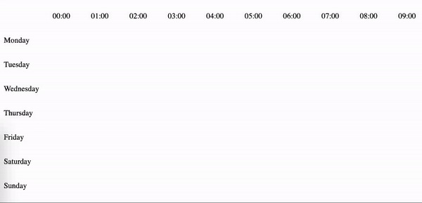

# React-iTimeslot



React-iTimeslot is a React component that can be use for any developer to handle timeslot.

### Usage

```js

import ReactiTimeslot from "react-itimeslot"

...
<ReactiTimeslot
  onChange={(data, day, time) => yourHandler()}
  iconSelected="<path_to_the_image>" // optional
  iconUnselected="<path_to_the_image>" // optional
/>
...
```
